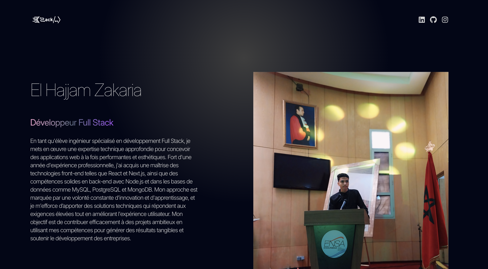
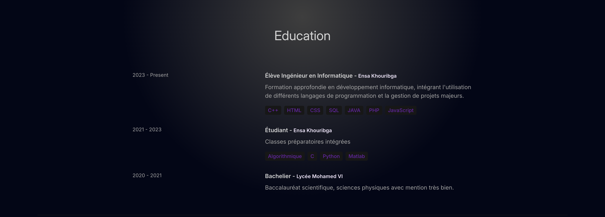
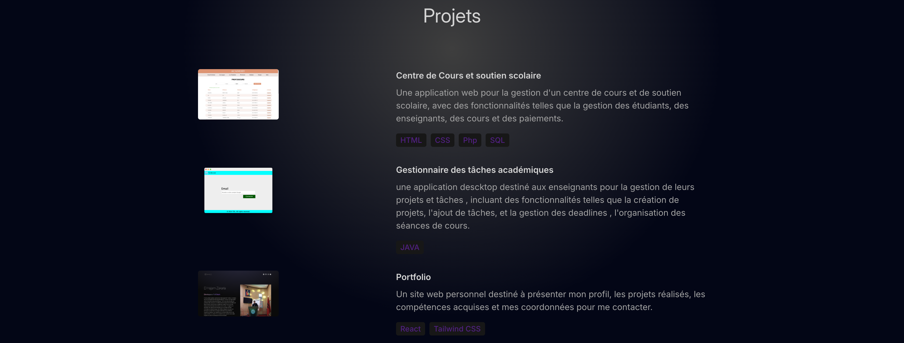

# Portfolio de Zakaria El Hajjam

Bienvenue sur mon portfolio en ligne ! Ce site est conçu pour montrer mes compétences en développement web et mes projets récents.

## 🚀 À propos du projet

Ce portfolio est réalisé avec :
- **React** pour une interface utilisateur interactive et réactive.
- **Tailwind CSS** pour un design moderne et personnalisable.
- **Framer Motion** pour des animations fluides et dynamiques.

## 🎨 Fonctionnalités

- **À propos** : Présentation générale avec une vue d'ensemble de mes compétences et de mon expérience.
- **Technologies** : Une section qui représente les technologies que je maîtrise.
- **Education** : Informations sur mon parcours.
- **Projets** : les projets que j'ai réalisés
- **Contact** : informations de contact pour me joindre directement.

## 🖼️ Captures d'écran

Voici quelques captures d'écran de mon portfolio :

### À propos

### Education

### Projets

### Contact

## 📧 Contact

Pour toute question ou remarque, vous pouvez me contacter à l'adresse suivante : elhajjamzakaria1@gmail.com

Vous pouvez consulter mon portfolio pour découvrir en plus mon profil : https://portfolio-theta-two-54.vercel.app/

Merci de visiter mon portfolio !
